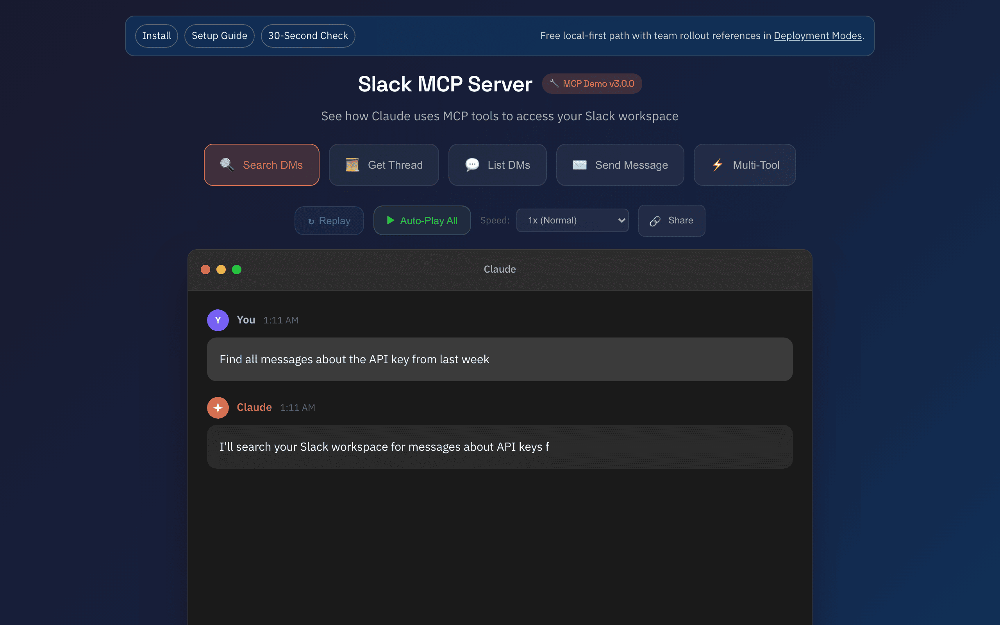

# Slack MCP Server

[](https://www.npmjs.com/package/@jtalk22/slack-mcp)
[](https://www.npmjs.com/package/@jtalk22/slack-mcp)
[](https://registry.modelcontextprotocol.io)
[](https://opensource.org/licenses/MIT)

Give Claude your Slack. 16 self-hosted tools for channels, search, replies, reactions, unread triage, and user search. Self-host free or use Slack MCP Cloud for Claude-first managed transport, Gemini CLI support, hosted credential handling, deployment review, procurement-ready security review, and a company-led path for teams that need rollout and continuity beyond Slack’s official/self-host MCP options.

## Verify & Proof

```bash
npx -y @jtalk22/slack-mcp --setup
npx -y @jtalk22/slack-mcp@latest --version
npx -y @jtalk22/slack-mcp@latest --doctor
npx -y @jtalk22/slack-mcp@latest --status
```

[20-second demo](https://jtalk22.github.io/slack-mcp-server/public/demo-video.html) · [Interactive demo](https://jtalk22.github.io/slack-mcp-server/public/demo.html) · [Start here discussion](https://github.com/jtalk22/slack-mcp-server/discussions/12) · [Latest release notes](https://github.com/jtalk22/slack-mcp-server/releases/latest) · [Release-day runbook](docs/LAUNCH-OPS.md) · [Commercial surface map](docs/COMMERCIAL-SURFACE.md) · [Demand & visibility ops](docs/DEMAND-VISIBILITY-OPS.md) · [Distribution ledger](docs/DISTRIBUTION-LEDGER.md) · [Release health snapshot](docs/release-health/latest.md) · [Version parity report](docs/release-health/version-parity.md) · [Cloud pricing](https://mcp.revasserlabs.com/pricing?utm_source=github&utm_medium=readme&utm_campaign=slack_mcp_cloud) · [Start Solo](https://mcp.revasserlabs.com/checkout?utm_source=github&utm_medium=readme&utm_campaign=slack_mcp_cloud&plan=solo) · [Start Team](https://mcp.revasserlabs.com/checkout?utm_source=github&utm_medium=readme&utm_campaign=slack_mcp_cloud&plan=team) · [Workflows](https://mcp.revasserlabs.com/workflows?utm_source=github&utm_medium=readme&utm_campaign=slack_mcp_cloud) · [Official vs Managed](https://mcp.revasserlabs.com/official-slack-mcp-vs-managed?utm_source=github&utm_medium=readme&utm_campaign=slack_mcp_cloud) · [Gemini CLI](https://mcp.revasserlabs.com/gemini-cli?utm_source=github&utm_medium=readme&utm_campaign=slack_mcp_cloud) · [Readiness](https://mcp.revasserlabs.com/readiness?utm_source=github&utm_medium=readme&utm_campaign=slack_mcp_cloud) · [Marketplace readiness](https://mcp.revasserlabs.com/marketplace-readiness?utm_source=github&utm_medium=readme&utm_campaign=slack_mcp_cloud) · [Cloud deployment](https://mcp.revasserlabs.com/deployment?utm_source=github&utm_medium=readme&utm_campaign=slack_mcp_cloud) · [Cloud security](https://mcp.revasserlabs.com/security?utm_source=github&utm_medium=readme&utm_campaign=slack_mcp_cloud) · [Cloud support](https://mcp.revasserlabs.com/support?utm_source=github&utm_medium=readme&utm_campaign=slack_mcp_cloud)

[](https://jtalk22.github.io/slack-mcp-server/public/demo-video.html)

## Tools

| Tool | Description | Safety |
|------|-------------|--------|
| `slack_health_check` | Verify token validity and workspace info | read-only |
| `slack_token_status` | Token age, health, and cache stats | read-only |
| `slack_refresh_tokens` | Auto-extract fresh tokens from Chrome | read-only* |
| `slack_list_conversations` | List DMs and channels | read-only |
| `slack_conversations_history` | Get messages from a channel or DM | read-only |
| `slack_get_full_conversation` | Export full history with threads | read-only |
| `slack_search_messages` | Search across workspace | read-only |
| `slack_get_thread` | Get thread replies | read-only |
| `slack_users_info` | Get user details | read-only |
| `slack_list_users` | List workspace users (paginated, 500+) | read-only |
| `slack_users_search` | Search users by name, display name, or email | read-only |
| `slack_conversations_unreads` | Get channels/DMs with unread messages | read-only |
| `slack_send_message` | Send a message to any conversation | **destructive** |
| `slack_add_reaction` | Add an emoji reaction to a message | **destructive** |
| `slack_remove_reaction` | Remove an emoji reaction from a message | **destructive** |
| `slack_conversations_mark` | Mark a conversation as read | **destructive** |

All tools carry [MCP safety annotations](https://modelcontextprotocol.io/specification/2025-03-26/server/tools#annotations): 12 read-only (`readOnlyHint: true`), 4 write-path (`destructiveHint: true`). Only `slack_send_message` is non-idempotent.

\* `slack_refresh_tokens` modifies local token file only — no external Slack state.

## Cloud

Slack MCP Cloud provides 15 managed tools with hosted credential handling. Team adds 3 AI compound workflows for summaries, action items, and decisions. Claude is the primary path; Gemini CLI is the second supported client path on the hosted endpoint.

- Self-host if you want 16 tools, npm or Docker, and full operator control over runtime and tokens.
- Use Cloud if you want one remote endpoint, hosted credential handling, deployment review, buyer-facing security review, support, and a hosted account surface.
- Slack now has an official MCP path. Use [Official vs Managed](https://mcp.revasserlabs.com/official-slack-mcp-vs-managed?utm_source=github&utm_medium=readme&utm_campaign=slack_mcp_cloud) when the decision is about transport ownership versus managed rollout, workflow packaging, and continuity.
- Solo starts at `$19/mo`; Team is `$49/mo` and adds 3 AI workflows plus higher request capacity.
- Turnkey Team Launch starts at `$2.5k+`; Managed Reliability starts at `$800/mo+` for teams where rollout and operational continuity matter more than raw seat count.

| Plan | Price | Includes |
|------|-------|----------|
| Solo | $19/mo | 15 standard tools, AES-256-GCM encrypted storage, 5K requests/mo |
| Team | $49/mo | 15 standard + 3 AI compound tools, 3 workspaces, 25K requests/mo |
| Turnkey Team Launch | $2.5k+ | Deployment review, rollout sequencing, client setup guidance, first-production-use path |
| Managed Reliability | $800/mo+ | Ongoing operating review, token-health follow-up, workflow continuity support |

[Pricing](https://mcp.revasserlabs.com/pricing?utm_source=github&utm_medium=readme&utm_campaign=slack_mcp_cloud) · [Start Solo](https://mcp.revasserlabs.com/checkout?utm_source=github&utm_medium=readme&utm_campaign=slack_mcp_cloud&plan=solo) · [Start Team](https://mcp.revasserlabs.com/checkout?utm_source=github&utm_medium=readme&utm_campaign=slack_mcp_cloud&plan=team) · [Workflows](https://mcp.revasserlabs.com/workflows?utm_source=github&utm_medium=readme&utm_campaign=slack_mcp_cloud) · [Official vs Managed](https://mcp.revasserlabs.com/official-slack-mcp-vs-managed?utm_source=github&utm_medium=readme&utm_campaign=slack_mcp_cloud) · [Gemini CLI](https://mcp.revasserlabs.com/gemini-cli?utm_source=github&utm_medium=readme&utm_campaign=slack_mcp_cloud) · [Readiness](https://mcp.revasserlabs.com/readiness?utm_source=github&utm_medium=readme&utm_campaign=slack_mcp_cloud) · [Cloud Docs](https://mcp.revasserlabs.com/docs?utm_source=github&utm_medium=readme&utm_campaign=slack_mcp_cloud) · [Security & Procurement](https://mcp.revasserlabs.com/security?utm_source=github&utm_medium=readme&utm_campaign=slack_mcp_cloud) · [Procurement Brief](https://mcp.revasserlabs.com/procurement?utm_source=github&utm_medium=readme&utm_campaign=slack_mcp_cloud) · [Marketplace readiness](https://mcp.revasserlabs.com/marketplace-readiness?utm_source=github&utm_medium=readme&utm_campaign=slack_mcp_cloud) · [Account](https://mcp.revasserlabs.com/account?utm_source=github&utm_medium=readme&utm_campaign=slack_mcp_cloud) · [Deployment Review](https://mcp.revasserlabs.com/deployment?utm_source=github&utm_medium=readme&utm_campaign=slack_mcp_cloud) · [Cloud Support](https://mcp.revasserlabs.com/support?utm_source=github&utm_medium=readme&utm_campaign=slack_mcp_cloud) · [Privacy Policy](https://mcp.revasserlabs.com/privacy?utm_source=github&utm_medium=readme&utm_campaign=slack_mcp_cloud)

For rollout help or managed deployment review, use [Cloud deployment review](https://mcp.revasserlabs.com/deployment?utm_source=github&utm_medium=readme&utm_campaign=slack_mcp_cloud). For buyer-facing controls, storage, analytics, and procurement questions, use [Cloud security](https://mcp.revasserlabs.com/security?utm_source=github&utm_medium=readme&utm_campaign=slack_mcp_cloud) and the [procurement brief](https://mcp.revasserlabs.com/procurement?utm_source=github&utm_medium=readme&utm_campaign=slack_mcp_cloud). For direct self-serve purchase with first-party attribution, use [Start Solo](https://mcp.revasserlabs.com/checkout?utm_source=github&utm_medium=readme&utm_campaign=slack_mcp_cloud&plan=solo) or [Start Team](https://mcp.revasserlabs.com/checkout?utm_source=github&utm_medium=readme&utm_campaign=slack_mcp_cloud&plan=team). If the team is comparing Slack’s official path against a managed rollout path, use [Official vs Managed](https://mcp.revasserlabs.com/official-slack-mcp-vs-managed?utm_source=github&utm_medium=readme&utm_campaign=slack_mcp_cloud) and [Marketplace readiness](https://mcp.revasserlabs.com/marketplace-readiness?utm_source=github&utm_medium=readme&utm_campaign=slack_mcp_cloud). Reproducible self-host bugs stay in standard issues; hosted operational questions belong on [Cloud support](https://mcp.revasserlabs.com/support?utm_source=github&utm_medium=readme&utm_campaign=slack_mcp_cloud).

Operated by Revasser. Self-host support is best-effort; managed rollout and Cloud support stay on [mcp.revasserlabs.com](https://mcp.revasserlabs.com/?utm_source=github&utm_medium=readme&utm_campaign=slack_mcp_cloud).

## Install & Verify (Self-Hosted)

**Runtime:** Node.js 20+

```bash
npx -y @jtalk22/slack-mcp --setup
npx -y @jtalk22/slack-mcp@latest --version
npx -y @jtalk22/slack-mcp@latest --doctor
npx -y @jtalk22/slack-mcp@latest --status
```

The setup wizard handles token extraction and validation automatically.

<details>
<summary><strong>Claude Desktop (macOS)</strong></summary>

Edit `~/Library/Application Support/Claude/claude_desktop_config.json`:

```json
{
  "mcpServers": {
    "slack": {
      "command": "npx",
      "args": ["-y", "@jtalk22/slack-mcp"]
    }
  }
}
```

</details>

<details>
<summary><strong>Claude Desktop (Windows/Linux)</strong></summary>

Edit `%APPDATA%\Claude\claude_desktop_config.json`:

```json
{
  "mcpServers": {
    "slack": {
      "command": "npx",
      "args": ["-y", "@jtalk22/slack-mcp"],
      "env": {
        "SLACK_TOKEN": "xoxc-your-token",
        "SLACK_COOKIE": "xoxd-your-cookie"
      }
    }
  }
}
```

> Windows/Linux users must provide tokens via `env` since auto-refresh is macOS-only.

</details>

<details>
<summary><strong>Claude Code CLI</strong></summary>

Add to `~/.claude.json`:

```json
{
  "mcpServers": {
    "slack": {
      "type": "stdio",
      "command": "npx",
      "args": ["-y", "@jtalk22/slack-mcp"]
    }
  }
}
```

</details>

<details>
<summary><strong>Docker</strong></summary>

```bash
docker pull ghcr.io/jtalk22/slack-mcp-server:latest
```

```json
{
  "mcpServers": {
    "slack": {
      "command": "docker",
      "args": ["run", "-i", "--rm",
               "-v", "~/.slack-mcp-tokens.json:/root/.slack-mcp-tokens.json",
               "ghcr.io/jtalk22/slack-mcp-server"]
    }
  }
}
```

</details>

Restart Claude after configuration. Full setup guide: [docs/SETUP.md](docs/SETUP.md)

## Hosted HTTP Mode

For remote MCP endpoints (Cloudflare Worker, VPS, etc.):

```bash
SLACK_TOKEN=xoxc-... \
SLACK_COOKIE=xoxd-... \
SLACK_MCP_HTTP_AUTH_TOKEN=change-this \
SLACK_MCP_HTTP_ALLOWED_ORIGINS=https://claude.ai \
node src/server-http.js
```

Details: [docs/DEPLOYMENT-MODES.md](docs/DEPLOYMENT-MODES.md)

## Troubleshooting

**Tokens expired:** Run `npx -y @jtalk22/slack-mcp --setup` or use `slack_refresh_tokens` in Claude (macOS).

**DMs not showing:** Use `slack_list_conversations` with `discover_dms=true` to force discovery.

**Claude not seeing tools:** Verify JSON syntax in config, check logs at `~/Library/Logs/Claude/mcp*.log`, fully restart Claude (Cmd+Q).

More: [docs/TROUBLESHOOTING.md](docs/TROUBLESHOOTING.md)

## Docs

- [Setup Guide](docs/SETUP.md) — Token extraction and configuration
- [API Reference](docs/API.md) — All 16 tools with parameters and examples
- [Deployment Modes](docs/DEPLOYMENT-MODES.md) — stdio, web, hosted HTTP, Cloudflare Worker
- [Use Case Recipes](docs/USE_CASE_RECIPES.md) — 12 copy-paste prompts
- [Troubleshooting](docs/TROUBLESHOOTING.md) — Common issues and fixes
- [Compatibility](docs/COMPATIBILITY.md) — Client compatibility matrix
- [Support Boundaries](docs/SUPPORT-BOUNDARIES.md) — Scope and response targets
- [Docs Index](docs/INDEX.md) — Full documentation index

## Security

- Token files stored with `chmod 600` (owner-only)
- macOS Keychain provides encrypted backup
- Web server binds to localhost only
- API keys are cryptographically random (`crypto.randomBytes`)
- See [SECURITY.md](SECURITY.md) for vulnerability reporting

## Contributing

PRs welcome. Run `node --check` on modified files before submitting.

## License

MIT — See [LICENSE](LICENSE)

## Disclaimer

This project accesses Slack's Web API using browser session credentials. It is not affiliated with or endorsed by Slack Technologies, Inc. Slack workspace administrators should review their acceptable use policies.
