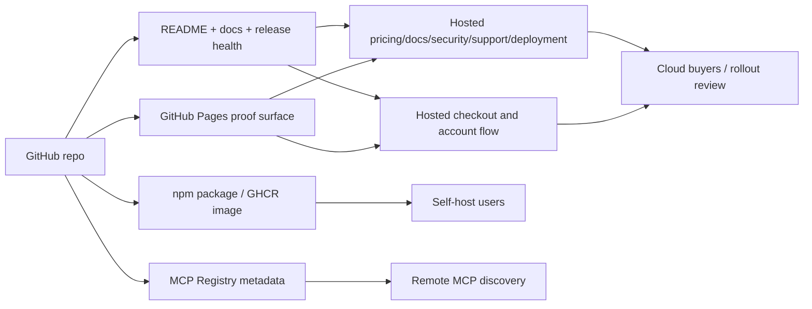
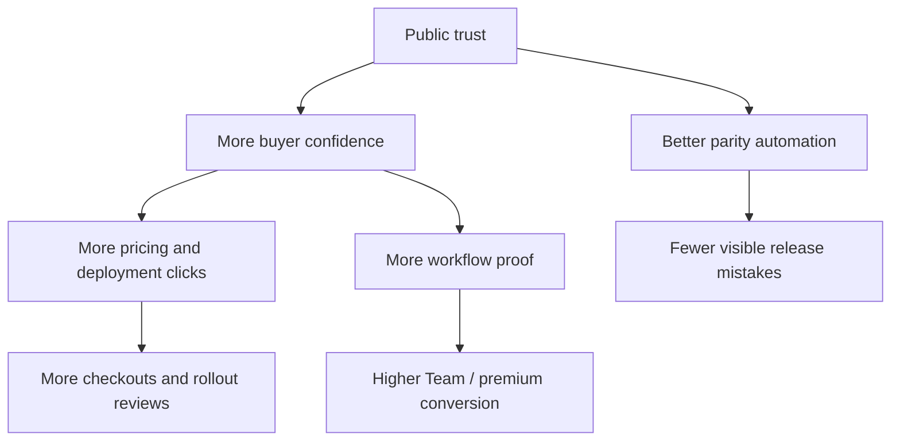

# Commercial Surface Map

This repo is the public self-host and release-trust surface for Slack MCP. It is not the entire product. The hosted commercial surface lives at [mcp.revasserlabs.com](https://mcp.revasserlabs.com), and the current external directory state is tracked in [Distribution Ledger](DISTRIBUTION-LEDGER.md).

## Current System

## Repo Job Definition

This public repo should do five things well:

1. establish self-host trust
2. prove release integrity
3. route Cloud buyers to the hosted surface
4. keep registry/npm/runtime parity visible
5. avoid looking noisy, abandoned, or bot-led

## What Changed

The repo is no longer just a launch artifact for an OSS tool. It now acts as:

- the public proof surface for self-host
- the distribution root for npm / Docker / MCP Registry
- the trust bridge into the hosted paid product
- the metadata bridge into secondary directories that often lag behind the real product surface

## Current Cloud Positioning

- Cloud is Claude-first
- Gemini CLI is supported as the second client path
- Slack now has an official MCP path, so the commercial wedge is managed rollout and continuity rather than generic protocol access
- Solo is the feeder plan
- Team is the shared product plan
- Turnkey Team Launch and Managed Reliability are the premium motions
- Hosted `/checkout` is now the first-party revenue entry so source attribution survives the move into Stripe and back to `/success`, `/setup`, and `/account`
- Hosted deployment review is now a verified intake path: Turnstile is bound to `deployment_review`, lead audit evidence is stored in D1, and operator plus submitter delivery state can be read from hosted funnel summaries
- Hosted comparison and distribution-posture pages now exist to answer the operator and buyer question directly:
  - [Official vs Managed](https://mcp.revasserlabs.com/official-slack-mcp-vs-managed?utm_source=github&utm_medium=docs&utm_campaign=slack_mcp_cloud)
  - [Marketplace readiness](https://mcp.revasserlabs.com/marketplace-readiness?utm_source=github&utm_medium=docs&utm_campaign=slack_mcp_cloud)

## Current Pain Points

### 1. Public repo can still over-rotate into OSS-only reading

The repo now routes well into Cloud, but some visitors will still read it as “just the package” unless the Pages proof surface and README stay current.

### 2. External listing drift is always a risk

npm, GHCR, MCP Registry, secondary directories, and hosted surfaces can drift if release discipline slips.

### 3. Hosted funnel visibility is only partly wired into public reporting

The public release-health script can read hosted funnel summaries, but only when hosted admin auth is provided. That means checkout starts/completes, entry pages, deployment-review verification state, and conversion detail will lag in public docs unless the summary token is available during report generation.

### 4. The public repo still cannot carry the full buyer conversation

That is intentional, but it means the handoff to hosted pricing/docs/deployment must remain obvious and current.

### 5. Slack’s official launch changes the reading of this repo

The repo should not position itself as “the Slack MCP server.” It now needs to route visitors into one of three clear answers:

- self-host / official-style operator ownership
- managed Cloud Solo or Team
- deployment review for rollout, buyer review, or reliability fit

## Current Strengths

- release-preflight is strong again
- public Pages are generated from shared metadata
- live Cloud status is read from hosted `/status`
- hosted security/procurement now has a dedicated route instead of being implied across other pages
- README now carries the self-host versus Cloud split credibly
- MCP Registry and homepage metadata are aligned with the hosted surface
- a checked distribution ledger now records the real state of MCP Registry, Glama, mcp.so, PulseMCP, and Smithery
- release-health can now surface hosted lead-verification and email-delivery evidence when hosted admin auth is available

## Next Opportunities

- Add more named workflow proof to the public Pages surface.
- Keep public buyer-trust links routed to hosted `/security`, `/deployment`, and `/support`.
- Pull hosted funnel summary into release-health whenever admin auth is available.
- Keep owned links pointed at hosted `/checkout`, `/pricing`, `/deployment`, `/security`, and `/support` so first-touch and last-touch attribution stay on the hosted surface.
- Keep owned links pointed at hosted `/official-slack-mcp-vs-managed` and `/marketplace-readiness` whenever the conversation is about fit or distribution posture rather than immediate purchase.
- Keep `3.2.5` as the metadata baseline that closed MCP Registry description drift, then monitor secondary crawlers for lag.
- Keep README and Pages focused on trust, not feature bloat.
- Continue reducing GitHub-side noise so public history looks operator-led.
