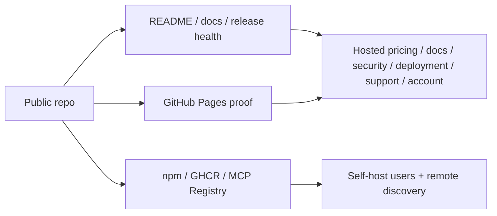

# Release-Day Runbook (`v3.2.5`)

This runbook defines the same-day ship order for `v3.2.5`, with reliability first and distribution, search, and monitoring checks folded into the same release motion.

## Current Surface Map



## Pre-Merge Gate

Run these from the release branch before merging:

```bash
node scripts/generate-public-pages.js
node scripts/verify-generated-public-pages.js
node scripts/check-public-surface-integrity.js
node scripts/verify-attribution-guardrail.js
node scripts/verify-core.js
node scripts/verify-web.js
node scripts/verify-install-flow.js
node scripts/release-preflight.js
node scripts/browser-smoke.js
npm pack --dry-run
docker build -t slack-mcp-smoke:3.2.5 . && docker run --rm slack-mcp-smoke:3.2.5 --version
```

## Release Sequence

1. Merge `v3.2.5` to `main`.
2. Confirm `CI` and `Attribution Guardrail` pass on `main`.
3. Push tag `v3.2.5`.
4. Wait for the `Docker` workflow on the tag to pass.
5. Create the GitHub Release immediately after Docker is green, using `.github/v3.2.5-release-notes.md`.
6. Wait for `Publish to npm` to complete from the GitHub Release event.
7. Verify npm, `npx`, and GHCR parity.
8. If MCP Registry is still stale after npm and GHCR are green, run the manual registry publish helper after `mcp-publisher login`.
9. Monitor MCP Registry, Glama, and Smithery/listing propagation until convergence.

## Release Invariant

- `docker-publish.yml` runs on tag push.
- `publish.yml` runs on GitHub Release creation.
- `publish.yml` now checks that the npm token belongs to a listed package owner before attempting publish.
- Do not create the GitHub Release before Docker passes, and do not treat the tag alone as a complete release.

## Same-Day Verification Commands

```bash
gh run list --repo jtalk22/slack-mcp-server --limit 10
npm view @jtalk22/slack-mcp version
npx -y @jtalk22/slack-mcp@latest --version
docker run --rm ghcr.io/jtalk22/slack-mcp-server:3.2.5 --version
node scripts/check-version-parity.js --allow-propagation
node scripts/check-version-parity.js --public --allow-propagation
node scripts/collect-release-health.js --public
bash scripts/check-npm-publish-auth.sh
bash scripts/publish-mcp-registry.sh server.json --validate-only
curl -s https://mcp.revasserlabs.com/status
curl -s https://mcp.revasserlabs.com/api
curl -s https://mcp.revasserlabs.com/pricing
curl -I "https://mcp.revasserlabs.com/checkout?plan=solo"
curl -I "https://mcp.revasserlabs.com/checkout?plan=team"
curl -s https://mcp.revasserlabs.com/security
curl -s https://mcp.revasserlabs.com/account
curl -I -H 'Origin: https://jtalk22.github.io' https://mcp.revasserlabs.com/status
node scripts/browser-smoke.js --mode live --base-url https://jtalk22.github.io/slack-mcp-server
```

## External Discovery Checklist

- GitHub Release page reflects `v3.2.5` verify commands, support path, and self-hosted vs Cloud split.
- npm page shows `3.2.5` and `npx` resolves to `slack-mcp-server v3.2.5`.
- GHCR `3.2.5` image exists and container `--version` matches.
- Hosted `/status` returns the deployed hosted version, tool counts, token modes, and docs/support/self-host URLs.
- Hosted `/pricing` reflects Solo, Team, Turnkey Team Launch, and Managed Reliability.
- Hosted `/docs` resolves to the hosted-native documentation surface, not a GitHub redirect.
- Hosted `/security` resolves to the buyer-facing controls and procurement surface.
- Hosted `/account` renders the authenticated usage, billing, token, and client-config surface.
- Hosted `/use-cases/support-triage` resolves and routes to pricing or deployment review.
- Hosted live browser smoke workflow passes against `https://mcp.revasserlabs.com/`.
- Hosted `/checkout?plan=solo|team` creates Stripe Checkout Sessions and preserves source attribution before redirect.
- MCP Registry latest is `3.2.5` and `websiteUrl` is `https://mcp.revasserlabs.com`.
- Glama shows `3.2.5` and the canonical homepage, or the drift is recorded in `docs/DISTRIBUTION-LEDGER.md`.
- Smithery listing remains reachable; if metadata lags, record a propagation note.
- GitHub Pages landing/demo/share surfaces load with current proof and a working Cloud `/status` snapshot.
- GitHub Pages live browser smoke workflow passes against `https://jtalk22.github.io/slack-mcp-server/`.
- Hosted deployment review routing is visible on the current repo trust surfaces.

## Monitoring Cadence

- First 4 hours: every 30 minutes
- Up to 24 hours: every 60 minutes

Track:
- install blockers and unique reporter count
- npm / GHCR / MCP Registry / Glama parity state
- GitHub Release page accuracy
- Cloudflare sessions, hosted funnel summary, checkout starts, provisioned keys, hosted deployment review requests, and support load
- inbound issue/discussion severity

## Triage Rules

P1 install blocker:
- acknowledge within 30-60 minutes
- provide immediate workaround
- pause promotion if multiple unique reports land

Rollout/support request:
- route teams to hosted deployment review
- keep public issue threads for reproducible product bugs and docs corrections

## Escalation Triggers

1. If install failures exceed 3 unique reports in 24h:
- pause outbound promotion
- prioritize hotfix

2. If support load exceeds 2 hours/day for 2 days:
- switch to stability-only mode
- defer non-critical requests

3. If Docker is green but npm/registry parity is still stale after expected propagation windows:
- record the lag in release-health
- run `bash scripts/publish-mcp-registry.sh server.json` using existing local publisher auth artifacts first
- if auth fails, run `mcp-publisher login github` once and retry `bash scripts/publish-mcp-registry.sh server.json`
- avoid claiming convergence until `check-version-parity` is clean

## Weekly Search and Listing Ops

1. Submit or refresh `https://mcp.revasserlabs.com/sitemap.xml` in Google Search Console and Bing Webmaster Tools.
2. Inspect:
   - `/`
   - `/pricing`
   - `/security`
   - `/gemini-cli`
   - `/workflows`
   - `/use-cases/support-triage`
3. Record indexed page count and any canonical or indexing warnings.
4. Compare Search Console clicks against hosted first-touch source mix in the hosted funnel summary.
5. Re-check `docs/DISTRIBUTION-LEDGER.md` and update any directory that still carries stale description or removed links.

## Registry Sync Path

Use this when npm and GHCR are already correct but MCP Registry still reports an old version or `websiteUrl`:

```bash
bash scripts/publish-mcp-registry.sh server.json
node scripts/check-version-parity.js
```

If publish fails due to auth, run:

```bash
mcp-publisher login github
bash scripts/publish-mcp-registry.sh server.json
node scripts/check-version-parity.js
```

## 24h / 48h / 72h Follow-Up

24h:
- publish release-health delta and short technical summary

48h:
- patch docs for top recurring setup or rollout questions

72h:
- ship `v3.2.6` only if defects are confirmed
